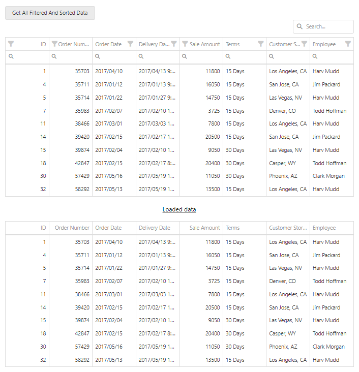

<!-- default badges list -->

<!-- default badges end -->

# DataGrid for DevExtreme - How to obtain all filtered and sorted rows

This example demonstrates how to obtain all filtered and sorted rows from the DataGrid component.

To test this functionality, you can filter or sort data in the UI and press "Get All Filtered And Sorted Data". See results in the second grid.

To implement this functionality, access a bound Store object and pass [loadOptions](https://js.devexpress.com/Documentation/ApiReference/Data_Layer/DataSource/Methods/#loadOptions) along with the [combined filtering expression](https://js.devexpress.com/Documentation/ApiReference/UI_Components/dxDataGrid/Methods/#getCombinedFilterreturnDataField) to its load() method. 

## Files to Review

- **jQuery**
    - [src.js](jQuery/src/index.js)
- **Angular**
    - [app.component.html](Angular/src/app/app.component.html)
    - [app.component.ts](Angular/src/app/app.component.ts)
- **Vue**
    - [Home.vue](Vue/src/components/HomeContent.vue)
- **React**
    - [App.tsx](React/src/App.tsx)
- **NetCore**    
    - [Index.cshtml](ASP.NET%20Core/Views/Home/Index.cshtml)

## Documentation

- [getDataSource()](https://js.devexpress.com/Documentation/ApiReference/UI_Components/dxDataGrid/Methods/#getDataSource)
- [DataSource.store()](https://js.devexpress.com/Documentation/ApiReference/Data_Layer/DataSource/Methods/#store)

<!-- feedback -->
## Does This Example Address Your Development Requirements/Objectives?

 

(you will be redirected to DevExpress.com to submit your response)
<!-- feedback end -->
